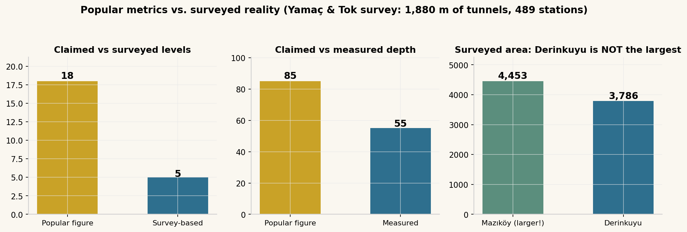
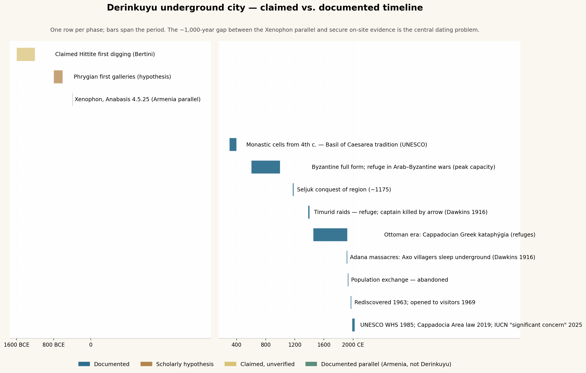

# Derinkuyu Underground City: References, Peoples, Languages, and the Problem of Functional Succession

*Deep research report — compiled 30 September 2026, revised around the functional-succession critique. Scope: textual references (including cuneiform), regional language vocabulary for underground living, the peoples plausibly associated with the site, their culture/religion/customs, and what psychology can legitimately say about them.*

## Executive Summary

Derinkuyu is the deepest excavated underground settlement in Cappadocia, but its popular biography rests on a hidden assumption: that the complex was *built for* the purpose it was last *used for*. This report treats it instead as a **functional palimpsest** — voids accreted over a millennium or more, each phase overwriting the evidence of the one before, with refuge and worship as documented *late* functions rather than proven *original* ones. **No ancient text — Greek, Hittite, Assyrian, or otherwise — names Derinkuyu.** Xenophon's famous passage describes underground villages in **Armenia**, not Cappadocia. Yet the regional languages do preserve a rich vocabulary of the underground: Hittite ritual pits (**ḫatteššar**, **āpi**) addressed the underworld through the earth; Akkadian distinguished caves (**ḫurru**) from cisterns (**būru**) and subterranean waterworks (**asurrakku**); Iron Age Luwian inscriptions carved within sight of Derinkuyu used the sign INFRA, "down"; and the site's own Cappadocian Greek inhabitants called the tunnels simply **καταφύγια** — "refuges." The secure phases are Byzantine-to-Ottoman; the Hittite and Phrygian origin claims remain hypotheses. Professional survey gives **five levels, ~55 m, 3,786 m²** — not the "18 levels / 85 m / 20,000 people" of tourism literature.

---

## 1. The Palimpsest Problem: Why "Built as a Refuge" Is an Assumption, Not a Finding

### 1.1 Rock-cut voids defeat stratigraphy

The central methodological fact about Derinkuyu is that it cannot be dated like a normal site. Volcanic tuff carries no deposition layers: each phase of enlargement physically destroys the surfaces of the phase before, leaving only tool marks, construction relationships, and the occasional intrusive artefact ([Destination History](https://destinationhistorypod.com/episodes/derinkuyu)). Roberto Bixio's typology-based dating method — the standard reference for the region — explicitly warns that first-carving dates can rarely be fixed for individual complexes, and the newest Turkish survey literature concedes the same for essentially every site ([Yamaç & Tok, Springer](https://link.springer.com/chapter/10.1007/978-3-032-16095-9_3)). This produces a dangerous asymmetry: the absence of pre-Christian evidence is expected *whether or not* pre-Christian phases existed, so it cannot be used to date the origin. "The complete visitor complex was not built by the Hittites" is demonstrable; "the first galleries are Byzantine" is not ([Trip to Cappadocia](https://triptocappadocia.com/en/cappadocia/hittite-and-phrygian-traces/)).

The correct model is therefore **functional succession**, a pattern documented elsewhere in the region: spaces carved for one purpose are absorbed into later systems and reinterpreted. Bixio's dating study of Cappadocian rock-cut dovecotes shows the mechanism concretely — rooms cut for pigeon-fertilizer production were later repurposed, enlarged, and misread by subsequent interpreters ([Bixio et al. 2023](https://www.researchgate.net/profile/Ali-Yamac/publication/374435688_Intended_Use_and_Dating_of_Dovecotes/links/651d63a3b0df2f20a210e9fc/Intended-Use-and-Dating-of-Dovecotes.pdf)). Yamaç's survey of the Koramaz Valley underground cities near Kayseri demonstrates that Cappadocian subterranean complexes had diverse original functions — storage shelters, agricultural cavities, refuges — with no single template ([Yamaç 2023, Springer](https://link.springer.com/chapter/10.1007/978-3-031-29374-0_5)). Applied to Derinkuyu, the defensible reading is: probable utilitarian origins (storage in the stable 8–13 °C tuff climate, water points, possibly winter quarters of the Armenian-plateau type), an *acquired* refuge function formalized during the Arab–Byzantine wars, Christian monumentalization of select spaces, and finally an ethnographically documented refuge custom lasting to 1909.

### 1.2 The assumption audit: what stands, what falls

The critique that "later use was read backward as original purpose" damages specific claims unequally, and the report grades them accordingly. **Falls or downgrades:** the narrative that Derinkuyu was "built as a Christian refuge city"; the 20,000-person capacity figure, which assumes a single-phase, purpose-designed complex occupied simultaneously; and the defensive reading of every feature, since a rolling-stone door also excludes thieves, weather, and animals, and a sealed well is also just a protected water source. **Stands:** the carved Christian features themselves — a cruciform plan, an apse, a baptistery are material facts cut into the rock in a Christian period regardless of what the rooms had been before; and the documented late uses (Dawkins' 1909 account, the καταφύγια name, the 1923 abandonment), which are ethnographic records rather than inference.

The engineering analysis also survives, in weakened form. Bixio reads the defensive system — isolation of sectors, internal movement, counterattack routes — as supporting coordinated resistance, not mere concealment ([History.com](https://www.history.com/articles/derinkuyu-turkey-underground-city)). That reading is most secure for the *arrangement* of the deep complex as captured by survey, i.e., for its medieval state; it cannot be extended to the hypothetical first galleries. Throughout this report, function attributions are tagged as **[carved feature]** (a physical fact of the surviving complex), **[documented use]** (a textual or ethnographic record), or **[backward projection]** (an inference from later phases onto earlier ones) — and the third category is where the refuge narrative mostly lives.

---

## 2. Site Profile: What Is Actually There

### 2.1 Physical layout and the two readings of "defensive engineering"

The complex is carved into volcanic **tuff**, soft enough to cut with simple tools yet self-supporting once exposed, holding a steady deep temperature of roughly **8–13 °C** ([History.com](https://www.history.com/articles/derinkuyu-turkey-underground-city), [Visit Cappadocia](https://visitcappadocia.net/en/travel-guide/derinkuyu-underground-city)). The Turkish name *Derinkuyu* — "deep well" — points to the shafts that served both the tunnels and the village above; the Cappadocian Greek name **Malakopia** (Μαλακοπέα; Turkish Melagobia/Melegobi) plausibly derives from *malakos*, "soft," naming the workable stone itself ([Wikipedia](https://en.wikipedia.org/wiki/Derinkuyu_underground_city)). The visitor-route logic is consistent across descriptions: **stables uppermost**, storage, soot-blackened kitchens with tandoor ovens and wine/oil presses in the middle, and the communal-religious spaces — a barrel-vaulted hall and a cruciform church — deepest down ([Wikipedia](https://en.wikipedia.org/wiki/Derinkuyu_underground_city), [Heritage for People / Univ. of Florence](https://heritageforpeople.unifi.it/feature/19)).

Every "military" feature admits a civilian reading, and both must be reported. Narrow single-file passages with half-tonne **rolling-stone doors** closable from inside, and wells cut beyond reach of the surface, are the canonical siege architecture **[backward projection onto origin; documented for medieval state]** — but they are equally the architecture of a storage system protecting grain, water, and livestock from theft and contamination ([Wikipedia](https://en.wikipedia.org/wiki/Derinkuyu_underground_city), [Derinkuyu Tours](https://www.derinkuyutours.com/architecture/)). What tips the mature complex toward organized defence is systemic: the segregation of levels with independent sealing, and redundant circulation, only make sense as threat management at scale — a *hardened* use-phase, whenever it began ([History.com](https://www.history.com/articles/derinkuyu-turkey-underground-city)).

### 2.2 Popular metrics versus surveyed data

The figures repeated in virtually all media — **18 levels, 85 m deep, capacity 20,000 people** — trace to tourism and encyclopaedia literature, not measured survey. The most rigorous published survey, by Ali Yamaç and colleagues, recorded **1,880 m of tunnel across 489 stations and 3,786 m² of area**, describing Derinkuyu as **five levels and 55 m deep** ([Academia.edu survey report](https://www.academia.edu/12014174/Surveying_Some_of_the_Underground_Cities_of_Cappadocia), [Jerusalem Journal of Archaeology](https://www.researchgate.net/profile/Ali-Yamac/publication/364324818_Some_Interesting_Underground_Cities_and_Peculiar_Underground_Structures_of_Kayseri_Turkey/links/63486022ff870c55ce216e34/Some-Interesting-Underground-Cities-and-Peculiar-Underground-Structures-of-Kayseri-Turkey.pdf)). The same project found **Mazıköy (Mazı) larger at 4,453 m²** — Derinkuyu's "largest" status rests on depth and fame, not measured area. About eight levels are open to visitors, and more than 600 entrances, many under house floors, have been located in the town above ([Wikipedia](https://en.wikipedia.org/wiki/Derinkuyu_underground_city)).

The capacity figure deserves special skepticism under the palimpsest model. A complex accreted over centuries was never occupied all at once by design, and "20,000 people" implies a planned refuge city that the survey evidence does not support; it functions in the literature as awe, not demography. Even the softer claim of "thousands" should be read as a ceiling estimate for the *mature* complex at its medieval maximum, assuming episodic crowding rather than residence — an assumption stack, not a measurement ([Dig Ventures](https://digventures.com/2015/11/archaeologists-are-exploring-an-ancient-underground-city-in-turkey/)).

---

## 3. The Textual Record: References and Misattributions

### 3.1 Xenophon's *Anabasis* 4.5.25 — the canonical "first reference" that isn't

Nearly every account of Derinkuyu states that Xenophon described it around 370 BCE, citing the *Anabasis*. The passage is real and worth quoting in full: "The houses here were underground, with a mouth like that of a well, but spacious below; and while entrances were tunnelled down for the beasts of burden, the human inhabitants descended by a ladder. In the houses were goats, sheep, cattle, fowls, and their young… Here were also wheat, barley, and beans, and barleywine in large bowls" ([Xenophon, *Anabasis*, ToposText](https://topostext.org/work/90), [Project Gutenberg](https://www.gutenberg.org/files/1170/1170-h/1170-h.htm)). Written from the march of the Ten Thousand in **401 BCE**, it is the oldest extant description of underground dwellings anywhere in Anatolia — and it is the closest textual witness to what *pre-refuge* phases of Cappadocian complexes may plausibly have looked like: winter dwellings built around livestock and stores.

The problem is geography. Xenophon places these villages in **Western Armenia**, three stages past the Teleboas river in the territory of the satrap Tiribazus, nowhere near Cappadocia ([Project Gutenberg](https://www.gutenberg.org/files/1170/1170-h/1170-h.htm)); modern route analysis localizes them to the **Erzurum–Aşkale plain**, where winter cold alone justifies underground habitation ([Paradeisopoulos, GRBS 53 (2013)](https://grbs.library.duke.edu/index.php/grbs/article/download/14807/6261/16307)). Xenophon never names Derinkuyu and describes single-family dwellings, not a multi-level defensive city. The correct formulation: *Anabasis* 4.5.25 documents an **Anatolian cultural practice of underground living by 401 BCE**, several hundred kilometres east — a terminus ante quem for the *practice* in the broad region and a model for utilitarian origins, but not a reference to any Cappadocian site. No other Greco-Roman author securely describes Cappadocian underground cities either; the "troglodytes" of classical literature belong to Libya and the Red Sea hills, not Anatolia.

### 3.2 The cuneiform question: Hittite words for the underworld, and the Kaniš null result

No cuneiform text — Old Assyrian, Hittite, or Neo-Assyrian — refers to Derinkuyu or to any identifiable Cappadocian underground city. The **Kültepe tablets (c. 1950–1840 BCE)** are the private archives of Assyrian merchants, concerned with caravans, loans, and family law; the underground spaces they attest are merchants' warehouse rooms where tablet baskets and jars were stored, nothing subterranean-urban ([Michel, CSMS Journal](https://shs.hal.science/halshs-00642827/document), [Wikipedia: Kültepe](https://en.wikipedia.org/wiki/K%C3%BCltepe)). If a city-scale underground complex had existed at Derinkuyu in the kārum period, roughly 75 km from Kaniš, the tablets give no hint of it — an argument from silence, but a loud one given how obsessively these merchants recorded infrastructure.

What cuneiform *does* provide is a vocabulary — and a theology — of the underground. Hittite ritual texts are saturated with **pit ceremonies**: the Ritual for the Drawing of Paths digs **nine pits** and smears them with blood; a house-purification ritual slaughters a lamb "down into a pit" (**ḫatteššar/patteššar**); foundation rituals dig an **āpi-pit** before the deity's table and treat the pit as "the gatekeeper to and from the underworld," imploring it not to release infernal forces ([Popkin, Hittite Animal Sacrifice](https://ecsi.se/sdc_download/212632/?key=tvzbfa81drh50lac81b51v1245zn4z), [Blood Expiation](https://dokumen.pub/blood-expiation-in-hittite-and-biblical-ritual-origins-context-and-meaning-writings-from-the-ancient-world-supplements-9781589835542-9781589835559-1589835549.html)). The underworld itself is **dankuiš daganzipaš**, "the dark earth," and the logogram **ᴰKASKAL.KUR** marks a divine underground watercourse linked to subterranean springs ([Nymphs of Lycia study](https://www.academia.edu/130237515/Nymphs_of_Lycia_An_Etymological_and_Historical_Study)). Most suggestively for the substrate question: in the ritual for the vanished Storm God of Nerik, the priest calls down into the offering pit **in the Hattic language** — the pre-Hittite tongue of the older population — which is precisely where a linguist would expect the chthonic register to survive ([Hittite ritual corpus summary](https://sunofchedorlaomer.fandom.com/wiki/Hittite_Kingdom)).

### 3.3 Iron Age neighbours in stone: Tabal's Luwian inscriptions

Between the Bronze Age and Byzantium, the landscape around Derinkuyu belonged to the Iron Age kingdoms conventionally called **Tabal**, whose rulers carved Hieroglyphic Luwian inscriptions on rock faces across the Nevşehir–Kayseri region. The **Topada inscription near Acıgöl** — a few kilometres from Derinkuyu — commemorates King **Wasusarma** of Tabal (the Wassurme of Assyrian sources, defeated by Tiglath-Pileser III) and dates to the second half of the 8th century BCE; **Suvasa, Sultanhan, and the Kayseri inscription** belong to the same royal circle ([Hittite Monuments: Topada](https://www.hittitemonuments.com/topada/), [Trip to Cappadocia](https://triptocappadocia.com/en/cappadocia/hittite-and-phrygian-traces/)). These are the closest contemporary written monuments to the site, and they establish a literate, Luwian-writing royal culture on the plateau exactly when the Phrygian-contact hypothesis places Derinkuyu's claimed first galleries.

The inscriptions even preserve the region's script-sign for vertical descent: the Hieroglyphic Luwian sign **INFRA (SUB, *56)** — an arm with the thumb exaggerated and pointing down — is read as "down/below" and appears in these same Tabal-period texts, e.g. "he came down (here) into the Aranean country" in the Türkmen-Karahöyük inscription of Great King Hartapu ([Goedegebuure et al. 2020](https://e-edu.nbu.bg/pluginfile.php/1471368/mod_resource/content/1/Osborne_turkmenkarahoyuk_1_a_new_hieroglyphic_luwian_inscription_from_great_king_hartapu_son_of_mursili_conqueror_of_phrygia.pdf)). None of this attests underground cities — it attests the political and linguistic environment in which early carving phases, if they existed, would have occurred, and it undercuts any notion that pre-Christian Cappadocia was a cultural blank waiting for Byzantine monks ([Mora, Balza, Bixio & De Pascale 2020, JSTOR](https://www.jstor.org/content/pdf/oa_chapter_edited/j.ctv10tq3v9.43?acceptTC=true&coverpage=false&addFooter=false)).

### 3.4 Late Ottoman and modern documentation: Dawkins, 1916

The earliest documentation that unambiguously concerns these complexes is ethnographic. The Cambridge linguist **Richard MacGillivray Dawkins**, working among Cappadocian Greek speakers in 1909–1911, recorded the practice and its trigger in one sentence: "their use as places of refuge in time of danger is indicated by their name καταφύγια [*kataphýgia*, 'refuges'], and when the news came of the recent massacres at Adana [1909], a great part of the population at Axo took refuge in these underground chambers, and for some nights did not venture to sleep above ground" (Dawkins 1916, *Modern Greek in Asia Minor*, p. 16, via [Wikipedia](https://en.wikipedia.org/wiki/Cappadocian_Greeks)). He also preserved local memory of **Timur's era**: a captain sent to hunt out the people of Kayseri hiding underground "was killed by an arrow shot through the hole in one of the doors" (Dawkins 1916, via [Wikipedia](https://en.wikipedia.org/wiki/Derinkuyu_underground_city)). These are the closest things the site has to primary documentary references, and both concern *use*, not construction.

Modern knowledge begins with the **1963 rediscovery** — a resident breaking through a basement wall into the tunnel system (the chickens vanishing into the crevice belong to the legend) — and the opening to visitors in **1969** ([Great Big Story](https://greatbigstory.com/the-ancient-underground-city-once-home-to-20000-people/), [Wikipedia](https://en.wikipedia.org/wiki/Derinkuyu_underground_city)). One naming claim should be quarantined: the assertion circulating in podcasts that the ancients called the city **"Elengubu"** has no traceable scholarly or textual basis; the only historically attested names are Greek **Malakopia** and Turkish **Derinkuyu** ([Destination History](https://destinationhistorypod.com/episodes/derinkuyu), [Wikipedia](https://en.wikipedia.org/wiki/Derinkuyu_underground_city)).

---

## 4. Words for the Underground: A Regional Language Survey

### 4.1 The Bronze and Iron Age layers

If pre-Christian phases of the Cappadocian complexes existed, the people who cut them spoke some selection of Hattic, Nesite (Hittite), Luwian, Hurrian, or the Old Assyrian of the Kaniš tablets — and each of these languages had its own underground lexicon. The survey below assembles the attested vocabulary with sources; the recurring pattern is that underground words cluster in **three semantic fields — water (wells, cisterns, subterranean courses), storage (pits, granaries), and the chthonic-sacred (offering pits, the dark earth)** — with "refuge from enemies" conspicuously absent from the lexical record until Greek καταφύγιον.

The Hattic layer is the most elusive but culturally the most pointed: the language of the plateau's pre-Indo-European population survives almost entirely inside Hittite cult texts, and its most prominent surviving context is precisely **invocations spoken down into offering pits** addressed to underworld powers — the oldest recoverable "underground speech" of the region ([Hittite ritual corpus summary](https://sunofchedorlaomer.fandom.com/wiki/Hittite_Kingdom), [Blood Expiation](https://dokumen.pub/blood-expiation-in-hittite-and-biblical-ritual-origins-context-and-meaning-writings-from-the-ancient-world-supplements-9781589835542-9781589835559-1589835549.html)). Nesite Hittite then supplies the descriptive vocabulary: **ḫatteššar** "pit, excavation" (also the sacrifice-verb root ḫatt(a)- "to slit" into it), **āpi-** "offering pit," **dankuiš daganzipaš** "the dark earth" as the underworld proper, and **ᴰKASKAL.KUR / NA4ḫekur SAG.UŠ** for underground watercourses and sacred rock monuments ([Popkin](https://ecsi.se/sdc_download/212632/?key=tvzbfa81drh50lac81b51v1245zn4z), [Nymphs of Lycia](https://www.academia.edu/130237515/Nymphs_of_Lycia_An_Etymological_and_Historical_Study), [Balza/Bixio/Mora/De Pascale 2017](https://www.academia.edu/32063276/A_link_between_ancient_words_and_the_underground_world_Cappadocian_landscape_rock_cut_structures_and_textual_evidence_from_Hittite_documentation_with_C_Mora_R_Bixio_A_De_Pascale_)). The Akkadian of the Kaniš merchants contributes the mercantile-practical register: **ḫurru** "hole, cavity, cave, cavern, grotto, mine" (logogram ḪABRUD), **būru(m)** "cistern, well, pool, pit," **gubbu** "cistern, well," and the Sumerian loan **asurrakku** "subterranean waters, deeply laid water conduit" — the vocabulary of someone who needs wells and storage, not hiding-places ([eBL Akkadian Dictionary](https://www.ebl.lmu.de/dictionary/hurru%20I), [Concise Dictionary of Akkadian](https://tuscriaturasarchivos.home.blog/wp-content/uploads/2018/12/A-Concise-Dictionary-of-Akkadian.pdf), [Assyrian Languages Project](https://www.assyrianlanguages.org/akkadian/dosearch.php?searchkey=8997&language=id)).

| Language layer | Underground vocabulary | Semantic field | Relevance to Derinkuyu |
|---|---|---|---|
| **Hattic** (substrate, <2000 BCE) | Pit invocations preserved in Hittite cult (e.g. the Nerik ritual) | Chthonic-sacred | Cultural depth of pit cult; no architectural attestation |
| **Nesite Hittite** (1650–1200 BCE) | ḫatteššar "pit/excavation"; āpi- "offering pit"; dankuiš daganzipaš "dark earth"; ᴰKASKAL.KUR underground watercourse; NA4ḫekur sacred rock | Chthonic-sacred + water | Regional lexicon; no site reference |
| **Luwian (Hieroglyphic)** (Tabal, 8th c. BCE) | INFRA (SUB *56) "down/below"; ara/i-ni "down into" | Directional | Inscriptions carved minutes from the site (Topada, Suvasa) |
| **Hurrian** | — (no relevant attested term located) | — | Null result |
| **Old Assyrian / Akkadian** (Kaniš, 1900 BCE) | ḫurru "cave/pit"; būru "well/cistern/pit"; gubbu "cistern"; asurrakku "subterranean waters" | Water + storage | Tablets silent on underground cities |
| **Armenian** (highlands east; Xenophon's region) | ayr "cave" (cf. Gr. ἄντρον? Hitt. ḫariya- "valley"?); anjav / kʻaranjav "cave; rock fortress, shelter" | Dwelling + fortress | Matches the utilitarian winter-dwelling parallel ([Wiktionary: ayr](https://en.wiktionary.org/wiki/%D5%A1%D5%B5%D6%80), [Armenian etymologies](https://vahagnakanch.wordpress.com/wp-content/uploads/2011/04/armenian-etymologies.pdf)) |
| **Greek** | ἄντρον, σπήλαιον "cave"; ὑπόγειος/κατάγειος "underground"; τρωγλοδύτης "cave-dweller"; καταφύγιον "refuge" | General + refuge | καταφύγιον becomes the local term of art |
| **Cappadocian Greek** (to 1923) | καταφύγια — the actual local name for the tunnels (Dawkins 1916) | Refuge | Direct attestation at Derinkuyu/Anaku ([Wikipedia](https://en.wikipedia.org/wiki/Cappadocian_Greeks)) |
| **Arabic** (raids era) | sirdāb "underground chamber" (< Pers. sardāb "cold-water" cellar); maḫzan "storehouse" | Storage + chamber | Vocabulary of the raiding period ([Dictionary.com](https://www.dictionary.com/browse/serdab)) |
| **Persian** | zirzamin "underground, cellar" (zir "under" + zamin "ground"); sardāb ice-cellar | Storage | Compound model later calqued in Turkish ([Wiktionary](https://en.wiktionary.org/wiki/%D8%B2%DB%8C%D8%B1%D8%B2%D9%85%DB%8C%D9%86)) |
| **Turkish** (Seljuk→modern) | yeraltı "under-ground"; mahzen "cellar" (< Arabic); dehliz "corridor" (< Persian dihlīz); sığınak "shelter"; Derinkuyu itself = derin "deep" + kuyu "well" | Descriptive-modern | Modern names encode well/storage perception |

### 4.2 What the lexicon implies — and the Cappadocian Greek dialect record

The lexical pattern across 3,500 years is itself evidence for the functional-succession model. Water and storage dominate every early layer — Hittite underground *watercourses*, Akkadian *wells and cisterns*, Persian *ice-cellars* — while the sacred register belongs to pits as interfaces with the underworld, not to habitation. Words meaning "refuge" or "fortress" attach to underground spaces late and locally: Armenian **anjav** drifts from "cave" toward "inaccessible cliff-cave, shelter or fortress" in medieval usage, and Cappadocian Greek **καταφύγιον** is, tellingly, not a word for a structure at all but a word for a *function* — "a place one flees to" — applied to pre-existing tunnels ([Armenian etymologies](https://vahagnakanch.wordpress.com/wp-content/uploads/2011/04/armenian-etymologies.pdf), [Wikipedia](https://en.wikipedia.org/wiki/Cappadocian_Greeks)). Language, like architecture, records adoption rather than original design.

The Cappadocian Greek dialect chain deserves note as the only *documented* speech community of the tunnels. Dawkins' 1916 grammar — the first scientific description, based on 1909–1911 fieldwork — placed **Malakopi (Derinkuyu) and Anaku (Kaymaklı) in the Northwestern Cappadocian dialect group**, and after the 1923 exchange the Athens Center for Asia Minor Studies published village grammars including Costakis' 1964 grammar of **Anaku itself** ([Karamanlidika/Wikipedia](https://www.karamanlidika.gr/en/cappadocian-greek-at-wikipedia/), [Wikimedia distribution map](https://commons.wikimedia.org/wiki/File:Distribution_of_Cappadocian_Greek-speaking_villages_in_Central_Anatolia_before_1924.jpg)). Modern dialectology continues the line with Karatsareas' Cambridge dissertation on Cappadocian Greek morphology ([Cambridge Repository](https://www.repository.cam.ac.uk/handle/1810/240868)). These dialects were heavily Turkish-influenced and are now moribund in the diaspora — but they are the only languages in this whole survey known, with certainty, to have been spoken *inside* the underground cities.

---

## 5. Who Dug and Used It: Peoples and Periods

### 5.1 The claimed builders: Hittites and Phrygians

The Hittite-origin hypothesis rests on three legs, none load-bearing: an essay by cave-architecture specialist A. Bertini suggesting the Hittites "may have excavated the first few levels in the rock when they came under attack from the Phrygians around 1200 BC"; reports of Hittite artefacts found inside; and the argument from capability, since the Hittites dominated the plateau and knew rock-cut construction — their fortifications routinely included covered sally-passages (poterns) ([Great Big Story](https://greatbigstory.com/the-ancient-underground-city-once-home-to-20000-people/), [Trip to Cappadocia](https://triptocappadocia.com/en/cappadocia/hittite-and-phrygian-traces/)). Bertini himself cautioned that the oldest stone-tool-cut cavities could be substantially older than 1200 BCE, and artefacts in a reused cavity prove deposition, not construction. Note also that Bertini's scenario already assumes the *refuge* reading for the earliest phase — the very assumption this report flags.

The **Phrygian hypothesis is the mainstream origin story**: Turkish cultural authorities date first carving to roughly the **8th–7th centuries BCE**, and classical archaeologist Andrea De Giorgi notes the Phrygians' documented bent for monumental rock-cutting and the Iron Age toolkit for the job ([Dig Ventures](https://digventures.com/2015/11/archaeologists-are-exploring-an-ancient-underground-city-in-turkey/), [Great Big Story](https://greatbigstory.com/the-ancient-underground-city-once-home-to-20000-people/)). Even this is hypothesis: no Phrygian inscription marks the site, the excavated finds run overwhelmingly Byzantine-to-Ottoman, and the Tabal-period Luwian inscriptions nearby (Section 3.3) are a reminder that "Phrygian period" need not mean "Phrygian hands" — Wasusarma's kingdom was Luwian-writing ([Hittite Monuments: Topada](https://www.hittitemonuments.com/topada/)). The most defensible statement remains: some first galleries may predate the Christian era, the bulk of the deep complex does not, and no single civilization "built Derinkuyu."

### 5.2 The documented users: Byzantine Christians and Cappadocian Greeks

From the late Roman period the picture solidifies. Christian inhabitants expanded earlier caverns into multi-level structures with chapels and Greek inscriptions, reaching **full form in the Byzantine era**, with the great expansion tied to the **Arab–Byzantine wars (c. 780–1180)** when plateau populations retreated underground before Umayyad and Abbasid raiding armies ([Wikipedia](https://en.wikipedia.org/wiki/Derinkuyu_underground_city)). Diana Darke's regional rhythm — "a settled if cautious life" underground during raids, resurfacing to carve the Göreme and Soğanlı cliff churches when Byzantine control returned between the 7th and 11th centuries — frames the tunnels as *a season of danger made architectural*, not a permanent residence (Darke 2011, via [Wikipedia](https://en.wikipedia.org/wiki/Derinkuyu_underground_city)). This is the phase in which the refuge reading of the architecture is no longer projection but fit.

Later documented users follow the same logic through successive threats: refuge during the **Seljuk** advance (region fallen by 1175), the **Timurid** incursions (Dawkins' arrow anecdote), and four Ottoman centuries in which the Greek villages of **Malakopi (Derinkuyu) and Anaku (Kaymaklı)** kept the tunnels as καταφύγια, with documented use in **1909** and abandonment in the **1923–24 population exchange** ([Greek Reporter](https://greekreporter.com/2026/02/07/greeks-of-cappadocia-turkey/), [History Hit](https://www.historyhit.com/locations/cappadocia-underground-cities/)). The community's end came by diplomacy, not conquest — and with it ended the last living knowledge of the tunnels' extent, which is one reason the 1963 rediscovery was genuinely a *re*discovery.

| Period | Group | Role claimed/documented | Evidence tier |
|---|---|---|---|
| c. 1600–1200 BCE | Hittites | Claimed first digging (Bertini) ([Great Big Story](https://greatbigstory.com/the-ancient-underground-city-once-home-to-20000-people/)) | Claimed, unverified |
| c. 1200–700 BCE | — | Stone-tool-cut oldest cavities (Bertini's caveat) | Speculative |
| 8th–7th c. BCE | Phrygian-era plateau (incl. Tabal) | First galleries (Turkish authorities; De Giorgi) ([Dig Ventures](https://digventures.com/2015/11/archaeologists-are-exploring-an-ancient-underground-city-in-turkey/)) | Scholarly hypothesis |
| 401 BCE | Armenians (elsewhere) | Xenophon's underground villages — *parallel only* ([GRBS](https://grbs.library.duke.edu/index.php/grbs/article/download/14807/6261/16307)) | Documented, wrong location |
| 4th c. CE | Anchorite/monastic Christians | Regional rock-cell tradition from Basil of Caesarea ([UNESCO](https://whc.unesco.org/en/list/357/)) | Documented (regional) |
| 7th–10th c. | Byzantine Christians | Full form; refuge in Arab raids ([Wikipedia](https://en.wikipedia.org/wiki/Derinkuyu_underground_city)) | Documented |
| 11th–14th c. | Local Christians | Refuge vs. Seljuks, Timurids | Documented |
| 15th–20th c. | Cappadocian Greeks | Kataphýgia; 1909 flight (Dawkins) ([Greek Reporter](https://greekreporter.com/2026/02/07/greeks-of-cappadocia-turkey/)) | Documented |
| 1923–24 | — | Abandoned in population exchange | Documented |
| 1963 / 1969 / 1985 | Turkish state | Rediscovery; opening; UNESCO inscription ([UNESCO](https://whc.unesco.org/en/list/357/)) | Documented |

---

## 6. Culture, Religion, and Customs of the Inhabitants

### 6.1 Byzantine Christianity and the monastic frame

The culture that left the deepest imprint is the Byzantine Christianity of the Cappadocian plateau — but under the succession model, it should be read as the *last great re-functionalization*, not the founding one. Monastic activity in the region is traced to the **4th century**, when anchorite communities acting on the teaching of **Basil the Great, bishop of Caesarea (Kayseri)**, began inhabiting rock-hewn cells; under the pressure of Arab invasions these hermitages aggregated into troglodyte villages and subterranean towns of which Derinkuyu is the type-case ([UNESCO](https://whc.unesco.org/en/list/357/)). Cappadocia produced the **Cappadocian Fathers** — Basil, Gregory of Nyssa, Gregory of Nazianzus — whose theology shaped Eastern monasticism, and its post-Iconoclastic painted churches are among the leading survivals of Byzantine art ([UNESCO](https://whc.unesco.org/en/list/357/), [Britannica](https://www.britannica.com/place/Goreme-National-Park)).

Inside the complex the religious footprint is a **[carved feature]**, immune to the succession critique at least as a final-phase fact: the **cruciform church** on a lower open level, smaller chapels, baptismal installations, and the **barrel-vaulted hall read as a religious school** — unique among Cappadocia's underground cities ([Wikipedia](https://en.wikipedia.org/wiki/Derinkuyu_underground_city), [Acetes Travel](https://acetestravel.com/derinkuyu-underground-city-cappadocia/)). The accompanying customs are monastic-communal: common refectories, shared stores, and the quietly devastating detail of **temporary tomb chambers where the dead were held until burial outside was safe** ([Acetes Travel](https://acetestravel.com/derinkuyu-underground-city-cappadocia/)). Worship, schooling, and burial all continued underground; the siege did not suspend the religious calendar.

### 6.2 Daily economy and domestic custom underground

The material culture reads as a frozen village economy: wine and oil presses with drainage channels, grain cellars and storage jars, communal kitchens with **tandoor ovens of a type still used in Cappadocian villages**, and upper-level stables with rock-cut mangers — a community able to carry its whole subsistence cycle below ground for weeks ([Wikipedia](https://en.wikipedia.org/wiki/Derinkuyu_underground_city), [Memphis Tours](https://www.memphistours.com/turkey/derinkuyu-underground-city)). Water security was engineered: the 55 m central shaft doubled as a well, and some sources were cut off from surface access against poisoning ([Wikipedia](https://en.wikipedia.org/wiki/Derinkuyu_underground_city)). Oil for lamps came from linseed-press rooms (*bezirhane* in comparable complexes), and the constant temperature made the depths as valuable for storage as for shelter ([National Geographic](https://www.nationalgeographic.com/history/article/150325-underground-city-cappadocia-turkey-archaeology)).

Two customs show a *living tradition*, not a fossil. The tunnels were embedded in surface village fabric — hundreds of entrances under house floors, so "going underground" was a household reflex ([Wikipedia](https://en.wikipedia.org/wiki/Derinkuyu_underground_city)). And the practice persisted into living memory: Dawkins' 1909 account of the Axo villagers sleeping underground on news of the Adana massacres shows the καταφύγιον custom functioning exactly as it had a millennium earlier (Dawkins 1916, via [Wikipedia](https://en.wikipedia.org/wiki/Cappadocian_Greeks)). Under the succession model, both observations generalize: whatever the tunnels' origin, each generation treated them as *infrastructure to be inherited and repurposed* — granary, wine cellar, fortress, church, and finally memory.

### 6.3 The comparative and regional frame

Derinkuyu is one node of the densest concentration of artificial cavities known: **200–360 underground settlements** across Cappadocia's ~20,000 km² of tuff, over forty of them three or more levels deep ([History.com](https://www.history.com/articles/derinkuyu-turkey-underground-city), [Odyssey Traveller](https://www.odysseytraveller.com/articles/derinkuyu-underground-city-turkey/)). The repeated claim of an **8–9 km tunnel linking Derinkuyu to Kaymaklı** remains unverified in the scholarly literature ([Wikipedia](https://en.wikipedia.org/wiki/Derinkuyu_underground_city)). The 2014–15 discovery of a possibly larger complex beneath Nevşehir's castle hill — with its own Ottoman paper trail of water tunnels — shows the inventory still growing ([National Geographic](https://www.nationalgeographic.com/history/article/150325-underground-city-cappadocia-turkey-archaeology)).

| Site | Distinguishing features | Status/evidence |
|---|---|---|
| **Derinkuyu** (Malakopi) | Deepest excavated; religious school; cruciform church; 5 surveyed levels / 55 m ([JJA](https://www.researchgate.net/profile/Ali-Yamac/publication/364324818_Some_Interesting_Underground_Cities_and_Peculiar_Underground_Structures_of_Kayseri_Turkey/links/63486022ff870c55ce216e34/Some-Interesting-Underground-Cities-and-Peculiar-Underground-Structures-of-Kayseri-Turkey.pdf)) | Surveyed; open 1969 |
| **Kaymaklı** (Anaku) | Wider, more horizontal; church with nave + two apses, baptismal font; opened 1964 ([Greek Reporter](https://greekreporter.com/2026/02/07/greeks-of-cappadocia-turkey/)) | Surveyed; open |
| **Mazıköy (Mazı)** | Four entrances; church apse reliefs; **4,453 m² — surveyed larger than Derinkuyu** ([Academia.edu](https://www.academia.edu/12014174/Surveying_Some_of_the_Underground_Cities_of_Cappadocia)) | Surveyed |
| **Özkonak** | Hot-oil pouring holes; 5 cm inter-floor communication chimneys ([Turkish Museums](https://www.turkishmuseums.com/blog/detail/5-must-see-underground-cities-of-turkiye/10104/4)) | Open |
| **Tatlarin** | Corridor traps, rock-cut toilets, murals; garrison or monastery proposed ([Turkish Museums](https://www.turkishmuseums.com/blog/detail/5-must-see-underground-cities-of-turkiye/10104/4)) | Partially open |
| **Nevşehir castle hill** | Found 2014 under housing project; possibly largest of all ([National Geographic](https://www.nationalgeographic.com/history/article/150325-underground-city-cappadocia-turkey-archaeology)) | Under study |
| **Koramaz Valley (Kayseri)** | Cluster of underground cities near the Kaniš sphere; functionally diverse origins ([Yamaç 2023, Springer](https://link.springer.com/chapter/10.1007/978-3-031-29374-0_5)) | Surveyed |

---

## 7. Psychology: What Can and Cannot Be Said

### 7.1 The honest baseline: no direct assessments exist

No psychological study, assessment, or clinical literature deals with Derinkuyu's inhabitants specifically — the last of them left in 1923, decades before such instruments existed, and no retrospective psychological history of the community has been published. Anything presented as "the psychology of Derinkuyu's people" in popular media is projection. Research can only triangulate from two adjacent literatures — the **environmental psychology of subterranean spaces** and the **psychology of persecuted refuge communities** — and from one ethnographic datum (Dawkins 1909), all flagged as inference here.

The architecture does, however, record collective psychology in a coarse sense — and under the succession model, that record is legible only for the phases that *adapted* the tunnels for threat. A community investing generations of labour in ventilation, sealed wells, internal-only doors, and deep schools and chapels is planning for **repeated, anticipated danger**: institutionalized vigilance, not panic. Bixio's reading of the defensive system as supporting coordinated resistance implies shared doctrine and drilling — organizational psychology preserved in tuff — but this applies to the *hardened* phases and cannot be projected onto whoever first cut a storage gallery ([History.com](https://www.history.com/articles/derinkuyu-turkey-underground-city)).

### 7.2 Subterranean-environment psychology: the costs of living without sky

The modern literature on underground environments bears directly on what prolonged refuge demanded. Küller & Wetterberg's foundational study of **subterranean work environments** documented measurable psychological and physiological effects of reduced diurnal and seasonal light variation ([ScienceDirect](https://www.sciencedirect.com/science/article/pii/0160412095001018)). A 2024 design review synthesizes the mechanisms: absence of daylight disrupts **circadian regulation**, closed spaces carry documented negative psychological effects, and lighting quality is the most consequential design variable underground ([Baek et al. 2024, HERD](https://journals.sagepub.com/doi/abs/10.1177/19375867241238470)); experimental work confirms static lighting degrades alertness, sleep, and well-being relative to daylight-mimicking conditions ([Wang et al. 2024, Buildings](https://www.mdpi.com/2075-5309/14/4/1115)).

Two features of Derinkuyu read differently against this literature. The **psychological barrier of entering windowless depth** is real and measurable ([Mohirta 2012](https://www.academia.edu/download/35108349/Natural_lighting_and_psychological_barriers_in_underground_space.pdf)), yet the inhabitants mitigated the worst stressors with available technology — oil-lamp lighting (the bezirhane economy), a steady 8–13 °C climate removing thermal stress, and crucially **temporariness**: the pattern was episodic refuge with return to sunlight, not permanent occupancy, which modern research suggests contains the cumulative circadian and mood costs ([Soh et al. 2016](https://www.sciencedirect.com/science/article/pii/S1877705816341571)). If early phases were storage or winter dwellings — brief, task-focused visits — the psychological cost profile would have been lower still, one more reason the utilitarian-origin model is plausible.

### 7.3 Refuge and persecution psychology: the community under chronic threat

The ecological model of refugee mental health (Miller & Rasco) holds that outcomes depend less on trauma exposure than on the surrounding ecology — community cohesion, meaningful activity, preserved institutions all buffer chronic threat ([Google Books](https://books.google.com/books?hl=en&lr=&id=oVznVD0QGNcC&oi=fnd&pg=PR3&dq=siege+refuge+communities+psychology+hiding+persecution+resilience+anthropology&ots=H6tXeiz1Yg&sig=aIv-D7WU8paeBHfKShzb-8f1jPY)). Derinkuyu's refuge phases institutionalize exactly these buffers: the school, church, communal kitchen, and shared stores kept the structures of ordinary life running underground, the core of collective resilience. Agier's anthropology of refuge spaces adds the darker caveat: enclosed refuges oscillate between sanctuary and internment — a space that seals from the inside is also a space one cannot easily leave ([Agier 2002, SAGE](https://journals.sagepub.com/doi/abs/10.1177/146613802401092779)).

The ethnographic record supplies the human texture. Dawkins' 1909 vignette — villagers sleeping underground for nights on news of massacres a province away — documents a **hair-trigger collective threat response**, a community for whom the tunnels were a conditioned answer to fear (Dawkins 1916, via [Wikipedia](https://en.wikipedia.org/wiki/Cappadocian_Greeks)). Keynan's account of war trauma as a "hidden wound" transmitted across generations offers a frame for reading the καταφύγιον custom itself as inherited vigilance: by the Ottoman centuries, retreat underground was a standing cultural posture maintained for a millennium ([Keynan 2015](https://books.google.com/books?hl=en&lr=&id=-owGCAAAQBAJ&oi=fnd&pg=PP1&dq=siege+refuge+communities+psychology+hiding+persecution+resilience+anthropology&ots=qBNUSF-j6L&sig=JXvZZaek7Y6kmSxoEer2sM_8x9s)). These are interpretive frames, not diagnoses — the most rigorous psychology the evidence supports.

---

## 8. Fringe Claims and the Evidence Boundary

Derinkuyu attracts speculation disproportionate to its documentation. Erich von Däniken, visiting in the 1980s, argued such complexity could only be protection against attack "from the air" and floated extraterrestrial involvement — cited here only because it dominates search results ([History.com](https://www.history.com/articles/derinkuyu-turkey-underground-city)). The ancient name **"Elengubu"** is unsupported; the **"18 levels / 85 m / 20,000 inhabitants"** triad exceeds measured survey (Section 2.2); Neolithic or "lost civilization" origins have no artefactual basis ([Medium/Thought Collection](https://medium.com/the-thought-collection/the-mystery-of-derinkuyu-e13ac4032773)).

The seductive half-truths wear scholarly clothes and deserve the sharpest fencing. "Hittite artefacts were found inside" proves deposition, not construction; "the Hittites built poterns" proves capability, not attribution; "Xenophon described underground Anatolia" is true of Armenia, not Cappadocia ([Trip to Cappadocia](https://triptocappadocia.com/en/cappadocia/hittite-and-phrygian-traces/), [GRBS](https://grbs.library.duke.edu/index.php/grbs/article/download/14807/6261/16307)). And the subtlest of all — the one this revision addresses — is the assumption smuggled into otherwise careful writing: that because the tunnels' documented life was refuge and worship, their *beginning* must have been too. The discipline's own position is compact: date by typology and construction relationship, assume multi-period accretion by default, and reject single-civilization origin stories ([Yamaç & Tok, Springer](https://link.springer.com/chapter/10.1007/978-3-032-16095-9_3), [Jolivet-Lévy 2013](https://www.academia.edu/download/37397468/ECA09004.pdf)).

## 9. Current Status and Conservation

Derinkuyu and Kaymaklı are components of the UNESCO World Heritage property **"Göreme National Park and the Rock Sites of Cappadocia," inscribed in 1985** under criteria (i), (iii), (v) and (vii), the subterranean towns explicitly named as refuges of the troglodyte-village tradition ([UNESCO](https://whc.unesco.org/en/list/357/), [IUCN Outlook 2025](https://worldheritageoutlook.iucn.org/node/1109/pdf?year=2025)). Governance shifted in **2019**, when Law No. 7174 folded the national park into a new "Cappadocia Area" administration; the **2025 IUCN Conservation Outlook rates the property "significant concern"** — legal uncertainty, uncontrolled tourism (2–4 million visitors annually against ambitions of 7 million), illegal construction, and irrigation-dam humidity accelerating tuff deterioration ([IUCN Outlook 2025](https://worldheritageoutlook.iucn.org/node/1109/pdf?year=2025)).

Research capacity is improving. The specialist literature has consolidated around the Centro Studi Sotterranei lineage (Bertucci, Bixio & Traverso 1995; Bixio's 2002 dating methodology; the dovecote-dating programme of Bixio et al. 2023) and the Turkish survey school of Ali Yamaç and colleagues, whose Kayseri and Koramaz inventories systematically map the underground landscape closest to ancient Kaniš ([Bixio et al. 2023](https://www.researchgate.net/profile/Ali-Yamac/publication/374435688_Intended_Use_and_Dating_of_Dovecotes/links/651d63a3b0df2f20a210e9fc/Intended-Use-and-Dating-of-Dovecotes.pdf), [Yamaç 2023](https://link.springer.com/chapter/10.1007/978-3-031-29374-0_5)). The new Springer reference volumes by Yamaç and Tok (2026) are the current state of the art, and their insistence that first-carving dates remain undetermined for nearly every complex is the appropriate closing note for any honest account of Derinkuyu.

---

## 10. Verdict Table

| Question | Best-supported answer | Confidence |
|---|---|---|
| Was it originally built as a refuge? | **Unknown and probably not.** Refuge is a documented late function; origins plausibly utilitarian (storage/water/winter quarters). The founding purpose is archaeologically invisible | Moderate (as caution) |
| Referenced in any ancient text? | **No.** Xenophon 4.5.25 = Armenia; cuneiform silent ([GRBS](https://grbs.library.duke.edu/index.php/grbs/article/download/14807/6261/16307)) | High |
| Referenced in cuneiform sources (incl. Kaniš)? | No site reference; rich underground *vocabulary* (Hittite ḫatteššar/āpi; Akkadian ḫurru/būru/asurrakku) ([eBL](https://www.ebl.lmu.de/dictionary/hurru%20I)) | High |
| Who built it? | Unknown; Phrygian-era first-phase hypothesis mainstream; Hittite claim unverified; full form Byzantine ([Dig Ventures](https://digventures.com/2015/11/archaeologists-are-exploring-an-ancient-underground-city-in-turkey/)) | Moderate |
| Who demonstrably used it? | Byzantine Christians; Cappadocian Greeks to 1923 (Dawkins 1909 record) ([Wikipedia](https://en.wikipedia.org/wiki/Cappadocian_Greeks)) | High |
| What did locals call it? | καταφύγια "refuges" (Cappadocian Greek); Malakopia "soft (rock) place"; Derinkuyu "deep well" ([Wikipedia](https://en.wikipedia.org/wiki/Derinkuyu_underground_city)) | High |
| Its culture/religion? | Final-phase Byzantine Orthodox monastic-communal: church, school, burial customs underground ([UNESCO](https://whc.unesco.org/en/list/357/)) | High |
| Psychology of its people? | None direct; defensible inferences from subterranean-environment and refuge-community psychology only ([Baek et al. 2024](https://journals.sagepub.com/doi/abs/10.1177/19375867241238470)) | Inference only |
| "18 levels, 85 m, 20,000 people"? | Popular exaggeration; survey: 5 levels, 55 m, 3,786 m² ([JJA](https://www.researchgate.net/profile/Ali-Yamac/publication/364324818_Some_Interesting_Underground_Cities_and_Peculiar_Underground_Structures_of_Kayseri_Turkey/links/63486022ff870c55ce216e34/Some-Interesting-Underground-Cities-and-Peculiar-Underground-Structures-of-Kayseri-Turkey.pdf)) | High |
| Link to the Kaniš/Kültepe world? | Geographic and cultural proximity (~75 km; Koramaz cities near Kayseri; Tabal inscriptions nearby); no textual bridge ([Yamaç 2023](https://link.springer.com/chapter/10.1007/978-3-031-29374-0_5)) | High (as null) |
