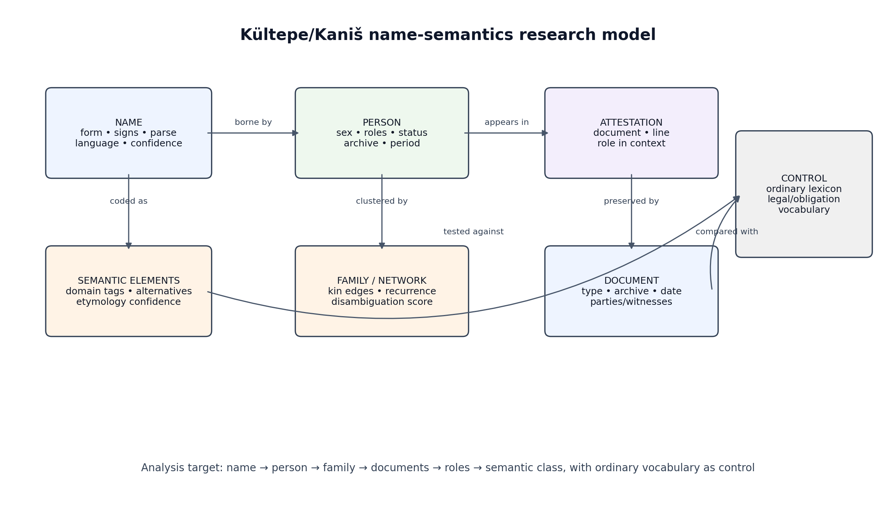

# Kültepe/Kaniš personal names: deep-research pilot for quantitative semantic analysis

## Executive Summary

The pilot should be built as a **relational prosopographic corpus**, not as a list of translated names. The defensible unit chain is **name → person → attestation → document → family/network → semantic coding**, with ordinary Old Assyrian vocabulary used as a control set. Larsen’s *Ancient Kanesh* supplies the family-and-names appendix and an index of Old Assyrian names, while Veenhof’s review of recent Kültepe text volumes confirms both the scale of the personal-name material and the continuing lack of a comprehensive Old Assyrian prosopography ([Cambridge](https://www.cambridge.org/core/books/ancient-kanesh/families-and-names/F378FD9C5CB2622A4DB75E901CCD39B5), [Veenhof 2020](https://shs.cairn.info/revue-d-assyriologie-2020-1-page-189?lang=fr)). Kloekhorst’s *Kanišite Hittite* is now the central linguistic reference because it explicitly analyzes the local personal names attested in Old Assyrian documents and argues that the main local language was a Hittite dialect distinct from later Ḫattuša Hittite ([Brill](https://www.degruyterbrill.com/de/document/isbn/9789004382107/html)).

The strongest immediate result is methodological: the table can already distinguish **secure attestation**, **overview-only classification**, and **unresolved etymology**. Ilališkan is the clearest pilot name because it is not merely listed as Anatolian; it also appears in role-bearing contexts, including an Anatolian smith list and a loan/real-estate context involving Humadašu and Ilališkan ([Michel 2015](https://shs.hal.science/halshs-01359688/document), [Michel 2016](https://shs.hal.science/halshs-01674007v1/document)). By contrast, Atamakuni and Taripiazi should remain in the unresolved layer until tablet-level attestations are extracted, and Wašunani should be flagged for normalization/reading problems rather than treated as a settled Luwian name.

A second result, added after the pilot's first circulation, is the resolution of the **Kt 86/k 41 dossier**: Veenhof's 2024 edition (KT 12) of that name list has been located and consulted, a corpus-wide check shows that all eleven names in the list are hapaxes or near-hapaxes (only Ḫarza has a small name family), and Zehnder's classification places Pikašnurikizi among names assignable to Hattian or to an unknown language — not to Hittite or Luwian ([Akkadian OCR Corpus](https://huggingface.co/datasets/lkevincc0/Akkadian-OCR-Corpus), [OARE](https://oare.byu.edu), [nl.Wikipedia citing Zehnder 2010](https://nl.wikipedia.org/wiki/K%C3%BCltepe)). See §10.

## 1. Evidentiary base: what the corpus can and cannot support

The Kültepe/Kaniš material is unusually suitable for the proposed experiment because the tablets are not isolated lexical specimens; they are merchant-archive documents in which people appear as creditors, debtors, witnesses, guarantors, judges, attorneys, family members, officials, craftspeople, and parties to disputes. Veenhof’s chronique explicitly notes that personal names are numerous, that namesakes are common, and that the absence of a comprehensive Old Assyrian prosopography remains a serious obstacle ([Veenhof 2020](https://shs.cairn.info/revue-d-assyriologie-2020-1-page-189?lang=fr)). The same review praises indexes that add abbreviated data on family relationship and role—writer or recipient, creditor, debtor, party in conflict, witness—because those features make interconnection and identification easier ([Veenhof 2020](https://shs.cairn.info/revue-d-assyriologie-2020-1-page-189?lang=fr)).

The chronological and archival bias must be coded from the start. Kloekhorst states that the vast majority of the roughly 23,000 Old Assyrian tablets come from Kaniš Lower Town level II, conventionally about **1970–1835 BCE**, whereas level Ib, about **1835–1710 BCE**, has yielded only around **450 tablets**; his siglum “[Ib]” is therefore essential whenever a tablet belongs to the later stratum ([Brill](https://www.degruyterbrill.com/de/document/isbn/9789004382107/html)). This matters for any claim about Hurrian names appearing “late,” for any comparison between level II and level Ib, and for any attempt to convert raw name counts into cultural interpretation.

| Corpus anchor | What it contributes | Limitation to encode |
|---|---|---|
| Larsen, *Ancient Kanesh*, appendix “Families and Names,” pp. 281–290, plus index of Old Assyrian names | Family trees, recurring individuals, name index, interpretive synthesis ([Cambridge](https://www.cambridge.org/core/books/ancient-kanesh/families-and-names/F378FD9C5CB2622A4DB75E901CCD39B5)) | Book-level synthesis; still needs row-level extraction into person/attestation tables |
| Veenhof, “Kültepe Texts” chroniques | Confirms enormous name corpora, 56-page personal-name index in one reviewed collection, role categories, and prosopography problem ([Veenhof 2020](https://shs.cairn.info/revue-d-assyriologie-2020-1-page-189?lang=fr)) | Review evidence; not itself a complete name corpus |
| Kloekhorst, *Kanišite Hittite* | Linguistic methodology, phonological interpretation, Hittitoid/Luwic/Hurrian/Hattic/unclear classification framework, dialect argument ([Brill](https://www.degruyterbrill.com/de/document/isbn/9789004382107/html)) | Linguistic classification is not equivalent to social meaning |
| Dercksen ed., *Anatolia and the Jazira during the Old Assyrian Period* | Contains Goedegebuure on Central Anatolian language communities and Wilhelm on Hurrians in the Kültepe texts ([NINO](https://www.nino-leiden.nl/publication/anatolia-and-the-jazira-during-the-old-assyrian-period)) | Conference-volume chapters; individual chapters must be cited separately when used |
| Michel, professions and women/real estate studies | Supplies occupations, gendered patterns, Anatolian officials, smith lists, and women’s property/loan contexts ([Michel 2015](https://shs.hal.science/halshs-01359688/document), [Michel 2016](https://shs.hal.science/halshs-01674007v1/document)) | Profession and status must be distinguished; an occupation is not automatically an ethnic marker |
| Hertel, *Old Assyrian Legal Practices* | Legal institutions, dispute procedure, attorneys, judges, witnesses, verdicts, and legal terminology ([KU Copenhagen](https://researchprofiles.ku.dk/en/publications/old-assyrian-legal-practices-law-and-dispute-in-the-ancient-near-/)) | Legal vocabulary must be compared with ordinary prose, not assumed to be name semantics |

A first-pass corpus therefore needs to preserve **provenance** at the level of publication, tablet number, line, archive, archaeological level, and role-in-context. The most important design decision is that a row is never “Name = meaning.” A row is “this attestation of this name, borne by this person or unresolved cluster, in this document, in this role, with this linguistic analysis and this confidence.” That is the only structure that can later test whether semantic fields correlate with sex, family recurrence, office, legal exposure, or period.

## 2. Data model: the minimum tables that make the question testable

The relational model should separate entities that are often collapsed in informal onomastic discussion. A name is a linguistic object; a person is a historical actor; an attestation is an occurrence in a document; a document is a physical/textual witness with genre and provenience; a family or network is a cluster inferred from patronymics, co-attestation, seals, households, and transactional ties. Anderson’s dissertation is directly relevant here because it uses the Kültepe texts to reconstruct Old Assyrian social networks and explicitly addresses homonym disambiguation for demographic analysis ([Anderson 2018](https://www.academia.edu/37700929/The_Old_Assyrian_Social_Network_an_analysis_of_the_texts_from_K%C3%BCltepe_Kanesh_1950_1750_B_C_E_)). That work should not be copied uncritically, but it validates the computational premise: names become historically useful only when embedded in relations.

The control table is equally important. If the hypothesis is that legal/obligation semantics are disproportionately represented in personal names, the comparison set cannot be modern intuition about what sounds “legal.” It must be ordinary Old Assyrian vocabulary and formulaic practice: valid tablets, witnesses, testimony, debt confirmation, guarantors, summons, settlement, oath, and adjudication. Veenhof’s discussion of Old Assyrian archives describes valid tablets, witness testimony, depositions, memoranda of witnesses, and the movement between private settlement and kārum procedure ([Veenhof Archives](https://www.openstarts.units.it/bitstream/10077/8658/1/Veenhof_Archives.pdf)). Hertel’s book supplies the institutional and procedural frame for attorneys, judges, mediators, arbitrators, summonses, interrogations, oaths, and verdicts ([KU Copenhagen](https://researchprofiles.ku.dk/en/publications/old-assyrian-legal-practices-law-and-dispute-in-the-ancient-near-/)).

| Table | Required fields | Reason it exists |
|---|---|---|
| `names` | `name_id`, normalized form, raw transliteration, sign sequence, proposed parse, language assignment, assignment confidence, semantic elements, proposed meaning, semantic domain tags, etymology confidence, source refs | Prevents translation glosses from becoming evidence |
| `persons` | `person_id`, `name_id`, sex, roles, status, linguistic group, archive, level/period, family id, disambiguation score, source refs | Separates “common name” from “one well-documented person” |
| `attestations` | `attestation_id`, `person_id`, `name_id`, `document_id`, line/context, role in text, archive, date/level, count weight | Allows occurrence counts without equating them with population counts |
| `documents` | `document_id`, publication, tablet number, text type, archive, provenience, level/date, parties, witnesses, seals | Controls for genre and archive bias |
| `families_edges` | `person_a`, `person_b`, relationship type, evidence, confidence, source refs | Tests family recurrence and generational persistence |
| `ordinary_lexicon` | word/root, semantic domain, occurrences, genre/context, source refs | Baseline for overrepresentation tests |
| `coding_decisions` | entity id, coder, decision, rationale, alternative analyses, confidence, date | Makes later revision auditable |

The table architecture should also support **competing analyses**. A name may have one secure sign sequence but two possible segmentations; a person may be securely male by grammatical context but uncertainly linked to a family; a document may be securely dated to level Ib while the semantic analysis remains unresolved. For that reason, confidence belongs at the level of each claim—identity, sex, language, morphology, meaning, family link—not only at the level of the whole row.

## 3. Pilot-name extraction table

The pilot list should be read as a set of hypotheses with different evidentiary statuses. Some names have both classification and role evidence; others are known mainly from overview statements; at least one, Wašunani, needs a normalization caution because Luwian onomastic discussion also presents forms such as *Wa-su-na-ni* in connection with Luwian elements and sound changes ([Rietveld–Woudhuizen](https://www.talanta.nl/wp-content/uploads/2014/08/11-Lia_Rietveld-Fred_C._Woudhuizen.pdf)). The point of the table is not to finalize meanings; it is to expose exactly which cells are empty and which cells are strong enough to carry statistical weight later.

The classifications below should be read with Goedegebuure’s caution that language and ethnicity are not identical and that the Colony-period situation is better framed in terms of language communities than securely self-identified ethnic groups ([Goedegebuure 2008](https://voices.uchicago.edu/goedegebuure/files/2020/07/07_Goedegebuure.pdf)). Her model places proto-Hattians within the Kızılırmak bend, proto-Hittites to the southeast with Kültepe/Kaneš/Neša as one of their main cities, proto-Luwians further south and west, and proto-Hurrians to the east, while stressing that the Assyrian documents generally lump locals under *nuwaʿum* rather than giving us clean ethnic self-ascriptions ([Goedegebuure 2008](https://voices.uchicago.edu/goedegebuure/files/2020/07/07_Goedegebuure.pdf)).

| Name | Working classification | Attestation/role evidence located in this pass | Semantic status | Confidence | Next extraction needed |
|---|---|---|---|---|---|
| Ḫalkiaššu | Anatolian/Hittitoid in the standard onomastic literature; Kanišite Hittite is the frame for such local names ([Brill](https://www.degruyterbrill.com/de/document/isbn/9789004382107/html)) | No tablet-level row extracted yet in this pass; overview-level only | Theophoric possibility involving Ḫalki must be tested from sign sequence and context, not assumed | B for Anatolian/Hittitoid; C for semantic parse | Raw spellings, office contexts, date/level, family links |
| Ilališkan | Anatolian/Hittitoid; also relevant to the Ilali element seen in theophoric discussion | Listed among Anatolian smiths established in Kaneš, with tablet citation Kt 94/k 788:23 ([Michel 2015](https://shs.hal.science/halshs-01359688/document)); appears with Humadašu in a loan of **18 shekels of silver** to Hana and Pitianalka with house pledge ([Michel 2016](https://shs.hal.science/halshs-01674007v1/document)) | Do not code meaning yet; code roles first: smith; credit party | A- for attested role; B for linguistic class | Disambiguate whether smith Ilališkan and loan Ilališkan are same person |
| Išputaḫšu | Anatolian/Hittitoid in overview tradition; needs Kloekhorst-name treatment | A level-II seal/text study lists Išputaḫšu as Anatolian and as co-debtor/husband in one context ([Ricetti PDF](https://iris.uniroma1.it/retrieve/e3835315-d6cf-15e8-e053-a505fe0a3de9/Ricetti_Testi%20e%20impronte%20di%20sigillo%20provenienti%20dal%20livello%20II%20del%20karum%20Kanis_uno%20studio%20comparato.pdf)) | Unsettled; likely element comparison with išpud-/išpant- belongs in Kloekhorst-style phonological analysis | B | Full sign sequence, sex, spouse/family, debt role, archive |
| Tiwatia | Luwian-associated; often connected to Tiwaz/Tiwad in secondary discussion | Seal/debt context in kt 88/k 90: seals of Ilī-tikal, Adad-rabi the scribe, Tiwatia, Hašanšamawa, and Išbunuman over a debt of **1 mina of refined silver** owed to Puzur-Ištar ([Çeçen](https://dergipark.org.tr/en/download/article-file/771361)) | Theophoric solar link plausible but must remain an analysis, not a gloss | B+ | Confirm reading Tiwatia vs Tiwitia in the edition; extract all attestations |
| Ruwatia | Luwian-associated; review literature connects Ru-wa-ti-a/Ru-ti-a with Luwian onomastic sound-change arguments ([Rietveld–Woudhuizen](https://www.talanta.nl/wp-content/uploads/2014/08/11-Lia_Rietveld-Fred_C._Woudhuizen.pdf)) | Administrative/palace contexts are indicated by tablet snippets, including “Ruwatia Sapala” in a list of officials’ men and a separate reference to Ruwatia as chief of kennels in economic-extraction discussion ([Bilgiç](https://dergipark.org.tr/tr/download/article-file/1356094)) | Do not collapse to divine-name etymology without sign sequence | B | Full publication context for the administrative list and office title |
| Wašunani | Listed as Luwian in overview tradition, but normalization is unstable | No independent tablet-level attestation located in this pass; Luwian-name review discusses forms such as *Wa-su-na-ni* rather than exactly “Wašunani” ([Rietveld–Woudhuizen](https://www.talanta.nl/wp-content/uploads/2014/08/11-Lia_Rietveld-Fred_C._Woudhuizen.pdf)) | **Flag: possible reading/normalization problem** | C/D | Check Kloekhorst and OAPD/CDLI spellings before retaining as a name |
| Pikašnurikizi | Unassigned/unclear Anatolian | Lexicographic/epigraphic visibility as PN with sign sequence **pí-kà-áš-nu-ri-ki-zi** ([BYU OARE](https://oare.byu.edu/epigraphies/1a223841-4106-48d0-b1ab-7e068724df66)) | Unresolved by design; do not force Hattic or unknown-language etymology | C | Extract document, role, sex, date/level; test whether one person or several |
| Atamakuni | Unassigned/unclear Anatolian | No independent attestation located in this pass beyond overview repetition | Unresolved | D | Find tablet citation; if none, keep out of statistical numerator |
| Taripiazi | Unassigned/unclear Anatolian | No independent attestation located in this pass beyond overview repetition | Unresolved | D | Find tablet citation; if none, keep out of statistical numerator |
| Ḫarpatiwa | Hurrian in Wilhelm’s Kültepe discussion and overview tradition ([NINO](https://www.nino-leiden.nl/publication/anatolia-and-the-jazira-during-the-old-assyrian-period)) | Political/office context as *rabi simmiltim*; modern summaries note that Ḫarpatiwa was once treated as king but is now often understood as the powerful “chief of the staircase” ([Kültepe overview](https://de.wikipedia.org/wiki/K%C3%BCltepe)) | Hurrian name, but social meaning must come from office and period | B | Confirm whether bearer(s) are one official or multiple; extract level Ib contexts |
| Imrimuša | Hurrian in Wilhelm/overview tradition ([NINO](https://www.nino-leiden.nl/publication/anatolia-and-the-jazira-during-the-old-assyrian-period)) | No independent attestation located in this pass beyond overview repetition | Hurrian classification only; no semantic coding | C/D | Extract from Wilhelm 2008 or indexes before using in counts |

The table already shows why the project is nontrivial. Ilališkan can support a role analysis now; Tiwatia can support a debt/seal analysis after normalization; Ḫarpatiwa can support a status/office analysis; Pikašnurikizi has a sign sequence but no resolved semantics; Atamakuni and Taripiazi are not yet statistically usable because they are not attestation-anchored in this pass. That is exactly the sort of distinction the final corpus must preserve.

## 4. Linguistic frame: classification is not cultural meaning

Kloekhorst’s book is the methodological center because it treats the Kanišite names as a linguistic corpus requiring phonological interpretation, morphological segmentation, dating, men’s versus women’s names, family relations, and comparison with other sources ([Brill](https://www.degruyterbrill.com/de/document/isbn/9789004382107/html)). Its value for this project is not only the conclusion that the main local language was a Hittite dialect closely related to but distinct from later Ḫattuša Hittite; it is also the explicit separation of methodological stages before classification ([Brill](https://www.degruyterbrill.com/de/document/isbn/9789004382107/html)). That maps directly onto the table design: transliteration and sign sequence precede phonology; phonology precedes morphology; morphology precedes semantic-domain coding.

Goedegebuure’s chapter supplies the necessary sociolinguistic warning. She argues that ethnicity is a subjective construction and that the Old Assyrian documents are nearly silent on indigenous self-identification; therefore the safer analytic category is **language community**, not ethnicity ([Goedegebuure 2008](https://voices.uchicago.edu/goedegebuure/files/2020/07/07_Goedegebuure.pdf)). She also summarizes the Colony-period map in which proto-Hittites are associated with Kültepe/Kaneš/Neša, proto-Luwians lie farther south and west, proto-Hattians are within the Kızılırmak bend, and proto-Hurrians are to the east ([Goedegebuure 2008](https://voices.uchicago.edu/goedegebuure/files/2020/07/07_Goedegebuure.pdf)). This means a Luwian-looking name at Kaniš is not proof of a Luwian ethnic community at Kaniš; it is evidence of a name form in a contact zone.

| Linguistic stratum | Best current anchor | How to use it in the table | What not to infer |
|---|---|---|---|
| Old Assyrian/Akkadian | Merchant-archive language of the texts; legal and commercial vocabulary supplies the control set ([Veenhof Archives](https://www.openstarts.units.it/bitstream/10077/8658/1/Veenhof_Archives.pdf)) | Default language of documents, not necessarily of every personal name | Do not treat document language as bearer ethnicity |
| Kanišite Hittite/Hittitoid | Kloekhorst’s full onomastic account and dialect argument ([Brill](https://www.degruyterbrill.com/de/document/isbn/9789004382107/html)) | Primary local Indo-European classification for many Anatolian names | Do not equate Hittitoid name with Hittite political identity |
| Luwian/Luwic | Yakubovich’s Luvian sociolinguistics and review discussion of Luwian personal names and sound changes ([UChicago dissertation](https://isac.uchicago.edu/sites/default/files/uploads/shared/docs/yakubovich_diss_2008.pdf), [Rietveld–Woudhuizen](https://www.talanta.nl/wp-content/uploads/2014/08/11-Lia_Rietveld-Fred_C._Woudhuizen.pdf)) | Comparative layer for Tiwatia/Ruwatia-type names | Do not assume southern/western Luwian geography from one name |
| Hurrian | Wilhelm’s “Hurrians in the Kültepe texts” in the Dercksen volume ([NINO](https://www.nino-leiden.nl/publication/anatolia-and-the-jazira-during-the-old-assyrian-period)) | Small, probably later/status-marked layer | Do not generalize from rare names to a large Hurrian population |
| Hattic/unknown/unassigned | Goedegebuure’s contact model and Kloekhorst’s unclear-origin category ([Goedegebuure 2008](https://voices.uchicago.edu/goedegebuure/files/2020/07/07_Goedegebuure.pdf), [Brill](https://www.degruyterbrill.com/de/document/isbn/9789004382107/html)) | Preserve unresolved names as a real analytical class | Do not force an etymology to make the table look complete |

This is where the project can be more rigorous than a casual list of “legal names.” A semantic field is not demonstrated because a modern researcher can parse a name into plausible pieces. It is demonstrated when the segmentation survives source criticism, when the element recurs in a linguistically coherent set, when the people bearing it can be counted as individuals rather than duplicated attestations, and when the same semantic field is measured in ordinary vocabulary for comparison.

## 5. Semantic-domain coding and confidence tiers

The semantic ontology should be deliberately flat at first. Recommended primary domains are: **deity/theophoric**, **kinship**, **status/office**, **legal/obligation**, **property/economy**, **protection/shelter**, **strength/power**, **purity/quality**, **natural world**, **animal**, **body/physical**, **unknown/unresolved**. Each name can receive multiple tags, but one tag should be marked primary only if the morphology is secure enough to support it. A name containing a divine element should be coded `deity/theophoric` even if its broader social context is legal; otherwise the analysis will confuse name semantics with document genre.

Confidence should be coded separately for identity, language, parse, and meaning. A practical scale is: **A** secure for the relevant claim; **B** probable and usable with caution; **C** possible and usable only in sensitivity analysis; **D** unresolved and excluded from numerator counts. For example, Ilališkan can be **A-** for “attested as an Anatolian smith” because Michel gives the list and tablet citation, but only **B/C** for any proposed semantic parse until the name’s sign sequence and morphology are checked in Kloekhorst-style fashion ([Michel 2015](https://shs.hal.science/halshs-01359688/document), [Brill](https://www.degruyterbrill.com/de/document/isbn/9789004382107/html)).

| Claim type | A | B | C | D |
|---|---|---|---|---|
| Attestation | Tablet/publication/line identified | Secure publication but line/context incomplete | Secondary mention only | No citation located |
| Individual identity | Prosopographically secure | Probable cluster | Possible namesake | Unresolved homonym |
| Sex | Grammatical/contextual secure | Inferential | Unknown but suspected | Unknown |
| Language assignment | Secure in current specialist literature | Probable | Competing classifications | Unassigned |
| Semantic parse | Morphology and meaning secure | Plausible parse | Speculative | No parse |
| Family recurrence | Explicit kinship + repeated name | Repeated name in likely family cluster | Same archive only | No evidence |
| Social role | Explicit role in context | Title/profession likely | Incidental mention | No role |

This coding scheme prevents a common failure mode: a name with a beautiful proposed meaning but no attestation context can outrank a dull but well-documented name. In the final analysis, a D-level etymology attached to an A-level person is still usable for social distribution; an A-level etymology attached to a D-level person is not usable for demographic claims.

## 6. Quantitative design: what to count and how to test it

The first quantitative rule is to keep four denominators separate: **name forms**, **unique persons**, **attestations**, and **archives/families**. Veenhof’s complaint about namesakes and the need for capacity markers shows why raw name counts are insufficient ([Veenhof 2020](https://shs.cairn.info/revue-d-assyriologie-2020-1-page-189?lang=fr)). A merchant who appears in dozens of tablets can make a rare name look socially central, while a common name borne by many poorly documented people can look weak if only attestation counts are used.

The second rule is to model overrepresentation relative to ordinary vocabulary. Hertel’s legal-practice work and Veenhof’s archive discussion supply the ordinary-language procedural world: witnesses, valid tablets, testimony, debt confirmation, guarantors, summonses, mediation, arbitration, lawsuits, verdicts, and settlement ([KU Copenhagen](https://researchprofiles.ku.dk/en/publications/old-assyrian-legal-practices-law-and-dispute-in-the-ancient-near-/), [Veenhof Archives](https://www.openstarts.units.it/bitstream/10077/8658/1/Veenhof_Archives.pdf)). If names are to be compared with legal/obligation vocabulary, the same semantic tagger must be applied to both names and non-name words, with genre controls for contracts, letters, judicial records, lists, and memoranda.

| Analysis | Variables | Test | Main bias control |
|---|---|---|---|
| Domain overrepresentation | semantic domain × name vs ordinary lexicon | Fisher exact for sparse cells; chi-square for larger tables; BH correction across domains | Same coding ontology for names and ordinary words |
| Sex distribution | semantic domain × sex | Fisher/logistic regression | Exclude grammatical sex guesses below B confidence |
| Status/office | semantic domain × role/title | Logistic model with role categories | Separate palace officials, crafts, merchants, slaves |
| Family recurrence | domain × within-family repetition | Permutation within family clusters | Family random effect; avoid counting generations as independent |
| Archive bias | domain × archive | Mixed model with archive random effect | Compare with/without Šalim-Aššur-scale archives |
| Period change | domain × level II/Ib | Logistic or Poisson/negative-binomial with exposure offset | Code Kloekhorst’s “[Ib]” distinction; tiny Ib sample caution |
| Homonym sensitivity | all of the above under alternative person clusterings | Bootstrap over disambiguation thresholds | Report stable vs unstable results separately |

The strongest model will probably be a mixed-effects logistic model for each semantic domain: `domain_presence ~ sex + role + language_class + period + (1 | family) + (1 | archive)`, with an exposure offset where appropriate. For sparse domains, exact tests and permutation are more honest than large-sample approximations. For multiple comparisons, Benjamini–Hochberg false-discovery control is preferable to Bonferroni because the project is exploratory but still needs discipline.

## 7. Current defensible findings and non-findings

The defensible finding is not yet “legal concepts are overrepresented in names.” The defensible finding is that the corpus and scholarship are good enough to test that question, provided the dataset preserves attestation context and refuses premature etymologizing. Larsen gives the family-and-names anchor; Veenhof gives the scale and prosopographic warning; Kloekhorst gives the linguistic method; Goedegebuure gives the language-community frame; Wilhelm gives the Hurrian layer; Michel gives professions, gender, property, and some pilot attestations; Hertel gives the legal-procedure control ([Cambridge](https://www.cambridge.org/core/books/ancient-kanesh/families-and-names/F378FD9C5CB2622A4DB75E901CCD39B5), [Veenhof 2020](https://shs.cairn.info/revue-d-assyriologie-2020-1-page-189?lang=fr), [Brill](https://www.degruyterbrill.com/de/document/isbn/9789004382107/html), [Goedegebuure 2008](https://voices.uchicago.edu/goedegebuure/files/2020/07/07_Goedegebuure.pdf), [NINO](https://www.nino-leiden.nl/publication/anatolia-and-the-jazira-during-the-old-assyrian-period), [Michel 2015](https://shs.hal.science/halshs-01359688/document), [KU Copenhagen](https://researchprofiles.ku.dk/en/publications/old-assyrian-legal-practices-law-and-dispute-in-the-ancient-near-/)).

The clearest pilot-name result is Ilališkan. It is not just an item in a linguistic list: Michel places an Ilališkan among Anatolian smiths established in Kaneš, with a tablet citation, and her real-estate study quotes a loan in which Humadašu and Ilališkan lend **18 shekels of silver** to Hana and Pitianalka, with the house held as pledge ([Michel 2015](https://shs.hal.science/halshs-01359688/document), [Michel 2016](https://shs.hal.science/halshs-01674007v1/document)). That gives the project a genuine test case for disambiguation: are these the same individual, a family recurrence, or unrelated namesakes? The answer changes the counts.

The clearest caution is Wašunani. The overview tradition lists it among Luwian examples, but this pass did not locate a clean tablet-level attestation under that exact normalized form, while Luwian-name discussion presents related forms such as *Wa-su-na-ni* in arguments about Luwian elements and sound changes ([Rietveld–Woudhuizen](https://www.talanta.nl/wp-content/uploads/2014/08/11-Lia_Rietveld-Fred_C._Woudhuizen.pdf)). Before Wašunani is used in any numerator, the corpus needs the raw spelling, the edition, and a check against Kloekhorst’s treatment of Kanišite names.

The clearest gap is Imrimuša. Wilhelm’s chapter is bibliographically secure and the Dercksen volume table of contents confirms its place in the Old Assyrian context, but this pass did not locate an independent attestation for Imrimuša outside overview repetition ([NINO](https://www.nino-leiden.nl/publication/anatolia-and-the-jazira-during-the-old-assyrian-period)). It should remain in the table as a marked gap rather than being silently dropped, because gaps are part of the evidence about what is web-visible, what is print-only, and what requires manual index extraction.

## 8. Recommended build sequence

The next productive step is not more interpretation; it is controlled extraction. Start with the indexes and appendices that are already structured: Larsen’s appendix and Old Assyrian name index, the Kültepe volume indexes described by Veenhof, Kloekhorst’s name treatments, and the Dercksen volume chapters by Goedegebuure and Wilhelm ([Cambridge](https://www.cambridge.org/core/books/ancient-kanesh/families-and-names/F378FD9C5CB2622A4DB75E901CCD39B5), [Veenhof 2020](https://shs.cairn.info/revue-d-assyriologie-2020-1-page-189?lang=fr), [Brill](https://www.degruyterbrill.com/de/document/isbn/9789004382107/html), [NINO](https://www.nino-leiden.nl/publication/anatolia-and-the-jazira-during-the-old-assyrian-period)). Each extracted row should carry publication, page, tablet number, line, normalized name, raw spelling, sex, role, archive, level/date, and confidence.

After the first 100–300 rows, run a pilot audit before scaling. The audit should ask: how many names are attestation-anchored; how many persons are securely separated from namesakes; how many semantic tags are A/B versus C/D; how many rows come from one archive; how many are level II versus Ib; and how many ordinary-vocabulary control rows have been coded with the same ontology. Only after that audit should the project move to full statistical testing.

| Phase | Task | Output | Stop/go criterion |
|---|---|---|---|
| 1 | Extract pilot names plus near parallels from indexes | `names`, `attestations`, `documents` seed tables | ≥80% rows have publication/tablet/line or explicit gap flag |
| 2 | Add person clustering | `persons`, `families_edges` | Homonym sensitivity documented for every repeated name |
| 3 | Code semantic elements | `semantic_elements`, `coding_decisions` | No semantic tag without parse confidence |
| 4 | Build ordinary-vocabulary control | `ordinary_lexicon` | Same domains and confidence rules as names |
| 5 | Descriptive statistics | counts by domain, sex, role, language, archive, period | Archive bias measured before interpretation |
| 6 | Inferential tests | exact/logistic/permutation models with FDR | Results reported with effect sizes and sensitivity tiers |
| 7 | Cultural interpretation | only after controls | No claim survives if it depends on D-tier rows |

The final reportable claim should be narrow and strong. A good result would be: “Element/class X occurs in N distinct individuals and M attestations across A archives and F families; after controlling for archive and period, it is enriched among role R relative to ordinary vocabulary; the result is stable/unstable under homonym reclustering.” A bad result would be: “X means obligation, therefore Kanišite culture valued obligation.” The first is evidence; the second is a paraphrase wearing a costume.

## 9. Immediate next inputs

The fastest way to improve the table is to supply or extract three kinds of pages: Larsen’s “Families and Names” appendix and Old Assyrian name index; Kloekhorst’s treatments of the specific pilot names; and Wilhelm’s pages on Hurrian names in the Kültepe texts. The bibliographic anchors for those are now identified, and the table above marks exactly which pilot names are ready for extraction and which are still overview-only ([Cambridge](https://www.cambridge.org/core/books/ancient-kanesh/families-and-names/F378FD9C5CB2622A4DB75E901CCD39B5), [Brill](https://www.degruyterbrill.com/de/document/isbn/9789004382107/html), [NINO](https://www.nino-leiden.nl/publication/anatolia-and-the-jazira-during-the-old-assyrian-period)).

If those pages are provided, the next iteration should convert them into rows with no interpretive inflation: raw spelling, normalized form, context, role, sex, date/level, archive, family clue, linguistic assignment, semantic-domain tag, and confidence. That will turn the present pilot from a research design into the beginning of an actual corpus.

## 10. Case study resolved: the Kt 86/k 41 name list and Pikašnurikizi

### 10.1 The tablet and its editions

Kt 86/k 41 (excavated 2 August 1986) is a small tablet carrying a bare list of names with no verbs, no commodities, and no sums. It entered scholarship through a footnote — Donbaz's citation of it in *Studies Veenhof* (p. 94 n. 56), where he compared Šé-sù-ur wa-ta-ar in Kt 88/k 1090:1 and proposed that *watar* might be a title — and it has now received its first full edition as **text no. 3 of Kültepe Tabletleri XII**, Veenhof's publication of the 1986 campaign texts (TTKY VI/33¹, Ankara 2024). The edition was consulted here through the OCR layer of the Akkadian OCR Corpus, which reproduces the volume's transliteration and commentary ([Akkadian OCR Corpus](https://huggingface.co/datasets/lkevincc0/Akkadian-OCR-Corpus)). Veenhof's edition reads the list as: *Pá-ù-wa-ra-áš-tí, Ta-ri-pí-a-zi, Ha-ta-e-et, Ša-ra-at, Pá-ha-ar, Ha-ar-zi* (obv.); *Nu-a-an, Pi-ši-ša, Ha-ar-ša-an* (rev.); *Wa-ta-ar, Nu-a-at, Pi-kà-aš-nu-ri-ki-sí* (rev., continued) — eleven entries in all, the last being the name at the center of this dossier, which Veenhof reads with a final sign SÍ rather than the -zi of the earlier secondary quotation.

Veenhof's own description of the text is the most important sentence written about it to date: it is "a small list of 'Anatolian' names, many of which are unique and may have different linguistic affiliations" — note the scare quotes around "Anatolian" and the explicit allowance that the list may be linguistically mixed rather than homogeneous ([Akkadian OCR Corpus](https://huggingface.co/datasets/lkevincc0/Akkadian-OCR-Corpus)). In the same commentary he rejects both of Donbaz's earlier proposals: *watar* cannot be a title in this text because the entries are arranged as a bare onomasticon, and the *Nu-a-an* of line 7 cannot be connected with *nuʾāʾum* "native (Anatolian)," a suggestion Donbaz had built in NABU 1995/113 on a mistaken link to the Assyrian possessive pronoun *niāʾum* "the one of us." Both rejections matter for method: they close off two shortcuts — a title-reading that would have made the list an administrative roster, and an ethnic-label reading that would have made *Nuan* self-descriptive — and leave the list as what it physically is: an onomasticon of unparalleled names.

### 10.2 The specialist verdict and the hapax cluster

The decisive new evidence is Alwin Kloekhorst's assessment, communicated personally to Veenhof and printed in the KT 12 commentary: Kloekhorst — the author of the standard monograph on the local names, *Kanišite Hittite* — states that he **does not recognize these as names of Anatolians** and that they have "hardly any elements in common" with the names treated in his 2019 book, although a few forms happen to coincide with Hittite *common words*: *harzi* "he holds," *watar* "water," *haršan* "ploughed," and *taripia(n)zi* "they plough"; he was unable to read the list as a sequence of sentences ([Akkadian OCR Corpus](https://huggingface.co/datasets/lkevincc0/Akkadian-OCR-Corpus)). This is a stronger negative than anything obtainable from the hapax statistics alone: it is not merely that the names are rare in the merchant corpus, but that the leading specialist on Kanišite onomastics finds no onomastic grammar in them at all. The residual possibility that they encode a Hittite *text* (a sentence or sentences disguised as a name list) was explicitly tested by Kloekhorst and failed.

An independent corpus-wide check against the Old Assyrian text database confirms the "unique" half of Veenhof's description. Searching the OARE corpus for the exact spellings of Kt 86/k 41 yields the following distribution, after manual removal of false positives ([OARE](https://oare.byu.edu)):

| Name (KT 12 reading) | Raw spelling | OARE hits for spelling | Genuine attestations of the name | Notes |
|---|---|---|---|---|
| Peruwaḫšati | pá-ú-wa-ra-áš-tí | 1 | 1 | Hapax; the *Peruwa-* head is theophoric-looking but the whole recurs nowhere |
| Taripiazi | ta-ri-pí-a-zi | 1 | 1 | Hapax; resembles Hittite *taripia(n)zi* "they plough" per Kloekhorst |
| Ḫattaet | ḫa-ta-e-et | 1 | 1 | Hapax |
| Šarat | ša-ra-at | 5 | 1 | Other hits are Šarrat-Ištar ("Queen-Ištar") names or word-boundary artifacts |
| Paḫar | pá-ḫa-ar | 16 | ~1 | Other hits are the Akkadian verb/noun *paḫārum* "to assemble / assembly" |
| Ḫarza | ḫa-ar-zi | 4 | 2–3 | **The only name with a family**: Ḫarziūna (BIN 4 83; KTS 1 35a), Ḫarziga (Kt 91/k 422); also matches Hittite *harzi* "he holds" |
| Nuan | nu-a-an | 1 | 1 | Hapax; Donbaz's *nuʾāʾum* link rejected by Veenhof |
| Piššiša | pi-ši-ša | 4 | 1 | Other hits are artifacts of *nēpešum* spellings |
| Ḫaršan | ḫa-ar-ša-an | 1 | 1 | Hapax; matches Hittite *haršan* "ploughed" |
| Nu(w)at | nu-a-at | 6 | 1 | Other hits are artifacts of *mu-nu-a-at* spellings |
| Pikašnurikizi | pi-kà-aš-nu-ri-ki-sí | 1 | 1 | Hapax; no segment recurs except -kizi ≈ independent PN Kizi |

The structural conclusion is that Kt 86/k 41 is a **hapax cluster**: not one obscure name among common ones, but a deliberately gathered set of names that occur nowhere else in the published Old Assyrian documentation ([OARE](https://oare.byu.edu)). This distribution is itself evidence about the tablet's function. Ordinary merchant lists — debt notes, caravan rosters, witness lists — are built from the recurring onomasticon of the kārum community and therefore show heavy overlap with the corpus. A list in which eleven out of eleven names are unique or nearly so is statistically unlike any administrative list, which strengthens the hypothesis (already raised in the first edition) that the tablet records people who stood *outside* the usual Assyrian–Anatolian transactional pool — captives, slaves, refugees, or a marginal group — though the text gives no explicit genre marker and this remains an inference from distribution, not a reading.

### 10.3 Zehnder's classification and what it does and does not settle

The one existing classification of Pikašnurikizi in print is Thomas Zehnder's, in his catalogue-and-interpretation monograph on Hittite female names, *Die hethitischen Frauennamen* (DBH 29, Wiesbaden 2010). As reported in the secondary literature that cites his catalogue, Zehnder groups **Pikašnurikizi together with Atamakuni and Taripiazi** among the Kültepe names that cannot be assigned to a language: they may be **Hattian**, or they may belong to an **otherwise unknown language** — explicitly *not* to Hittite or Luwian ([nl.Wikipedia citing Zehnder 2010](https://nl.wikipedia.org/wiki/K%C3%BCltepe), [Antikforever/Kanesh](https://antikforever.com/kanesh/)). It is worth noting that two of the three names Zehnder treats as unassignable occur in Kt 86/k 41 itself (Pikašnurikizi, Taripiazi), which is consistent with the hapax-cluster picture above: the tablet is precisely where the corpus's unclassifiable names concentrate. (The catalogue entry itself was not directly inspected for this report — access to the full volume was blocked — so the classification is cited here through its secondary attestations; the book was reviewed by J. G. Dercksen in *Orientalistische Literaturzeitung* 109, pp. 196–199.)

Zehnder's grouping settles the negative question — this is not a disguised Hittite or Luwian name that specialists have simply failed to parse — but it leaves the positive question open between "Hattian" and "unknown," and it does not address segmentation. The earlier segment-level analysis in this dossier therefore stands, with one correction forced by KT 12: the internal segments (*pi-kà-aš*, *-nu-ri-*, *-ki-sí*) have no independent attestation as name elements anywhere in the corpus, and the only segment that matches anything real is the tail, **-kizi ≈ Kizi**, which exists as an independent personal name ([OARE](https://oare.byu.edu)). A *-kizi* suffix analysis is thus the only internal hypothesis with any corpus support, but it cannot be promoted to a parse, because a single shared final string is as consistent with coincidence as with morphology.

### 10.4 A methodological parallel: the Babala–Ahayatum contract

The same KT 12 volume contains a second text that functions as a control case for this project's core problem — inferring gender and ethnicity from names. Its text no. (OCR entry 152) is a unique marriage contract in which the editors reason explicitly from onomastics: the bridegroom's name Babala is an Anatolian man's name, independently attested for a son of Peruwa in TC 1, 68:4.7, while the bride's name A-ha-a-tum, despite looking exactly like the common Assyrian women's name Ahātum, is argued on contextual grounds to be something else; Veenhof's commentary states the operative principle outright — "their names may help us to choose" — when the document's grammar leaves the sexes ambiguous, and the editor notes that the scribe "went off the rails" in lines 22–28 ([Akkadian OCR Corpus](https://huggingface.co/datasets/lkevincc0/Akkadian-OCR-Corpus)). The case shows both the power and the documented danger of name-based inference at Kaniš: the same syllabary can encode an Anatolian name in a shape that is segmentally identical to an Assyrian one (A-ha-a-tum), so an attestation-level corpus must carry a flag for **homographic traps** of exactly this kind.

Applied back to Kt 86/k 41, the parallel licenses a specific caution about Pikašnurikizi. The name entered the dossier as a female name because Zehnder's catalogue is a catalogue of *Frauennamen* — but the tablet itself marks no gender, and the Babala–Ahayatum case demonstrates that even experienced editors treat name-based sex assignment as an argument to be made, not a datum to be read off. The corpus model should therefore record Pikašnurikizi's femaleness as **inherited from Zehnder's classification decision** (whose onomastic grounds were not accessible for this report) rather than as a property of the attestation. That is a small change in one row's metadata, but it is exactly the kind of provenance distinction this project exists to keep visible.

### 10.5 Updated verdict on Pikašnurikizi

Assembling the three threads — the KT 12 edition, the corpus-wide hapax check, and Zehnder's classification — the dossier now supports a sharper verdict than the pilot's original "unresolved." Pikašnurikizi is: (1) a **hapax legomenon** in the published Old Assyrian corpus, occurring once, in a list composed entirely of hapax or near-hapax names; (2) **not recognized as Anatolian** by the leading specialist in Kanišite onomastics, who also excluded reading the list as Hittite sentences; (3) classified in the only existing specialist treatment as **Hattian or of unknown language**, alongside Atamakuni and Taripiazi; and (4) segmentally opaque except for a possible tail match to the independent name Kizi, which is insufficient for a parse ([Akkadian OCR Corpus](https://huggingface.co/datasets/lkevincc0/Akkadian-OCR-Corpus), [OARE](https://oare.byu.edu), [nl.Wikipedia citing Zehnder 2010](https://nl.wikipedia.org/wiki/K%C3%BCltepe)). The honest positive statement is therefore narrow: the name is real, it is early (kārum-period find context, 1986 excavation season), it is embedded in a statistically anomalous onomasticon, and it most likely records a bearer from the non-Indo-European substrate — Hattian or an unattested language — of central Anatolia.

The larger methodological yield is that the "culture" half of the original question has an answer of a different kind than expected. No semantic content can be recovered from the name itself — any gloss would be fabrication — but the *tablet* carries recoverable cultural information: whoever wrote Kt 86/k 41 was collecting precisely the names that the merchant community's normal onomasticon did not contain. If that collection had an administrative purpose, the likeliest contexts are the ones in which Bronze Age archives enumerate outsiders: ration or labor lists, slave or captive rosters, or records of dependents. That hypothesis is testable in principle — parallel hapax-cluster lists should exist if the genre was real — and the OARE corpus now makes the test cheap: search for other small tablets whose name strings return corpus counts of one. That search is the natural next iteration of this project, and it converts an unanswerable question about one name into an answerable question about a genre.
